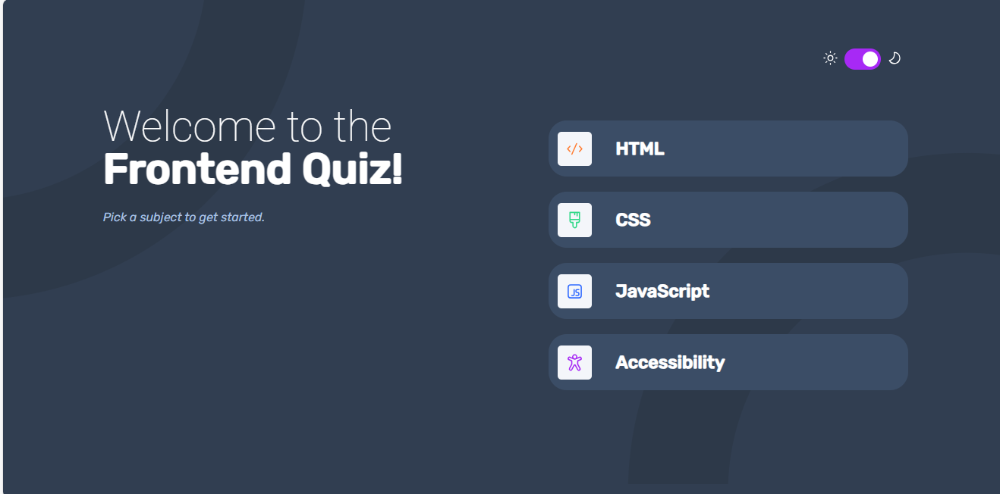
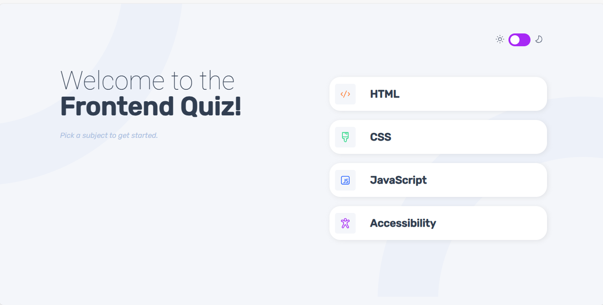

# React + TypeScript + Vite

## Expanding the ESLint configuration

# Frontend quiz app solution

Welcome to the Frontend Quiz App, a user-friendly React JS application built with TypeScript. This app allows users to take a quiz, view results, and replay with a different category. Designed with a light and dark mode toggler, responsive layout, and interactive feedback.

## Table of contents

- [Dark-mode Snapshot](#Preview)
- [Light-mode Snapshot](#Preview)
- [Links](#links)
- [Built with](#built-with)
- [Features](#features-of-the-App)
- [Installation&Configuration](#Installation-and-Configuration)
- [Author](#author)

### Dark-mode Snapshot

### Light-mode Snapshot

### Links

- Live Site URL: https://quizeapp-essel-amalitech-project.netlify.app/

### Built with

- Semantic HTML5
- CSS
- Typescript
- [React](https://reactjs.org/) - JS library

### features of the App

- Light and dark mode toggler
- Select quiz category
- Replay quiz with a new category
- Interactive feedback for answers
- Responsive layout for various screen sizes
- Hover and focus states for interactive elements

### Installation&Configuration

1. Ensure Node is installed on your machine.
2. Configure your project with vite@latest.
3. Run npm run dev in your terminal to view the site locally.
4. A simple way to view the site locally is by opening the dist folder in this project and locate index.html , open with live sever via your vscode or any prefered editor of your choice or just run the active file (index.html)

### Useful resources

- [React official site](https://reactjs.org/) - This is the Js library I used for the work
- [w3schools tutorials for HTML](https://www.w3schools.com/html/) - You can learn HTML here for free
- [w3schools tutorials for CSS](https://www.w3schools.com/css/) - You can learn CSS here for free too

## Author

- Name: Essel Apusiga Abraham
- Phone: 0509580947
- Email: mailto:abrahamessel156@gmail.com
